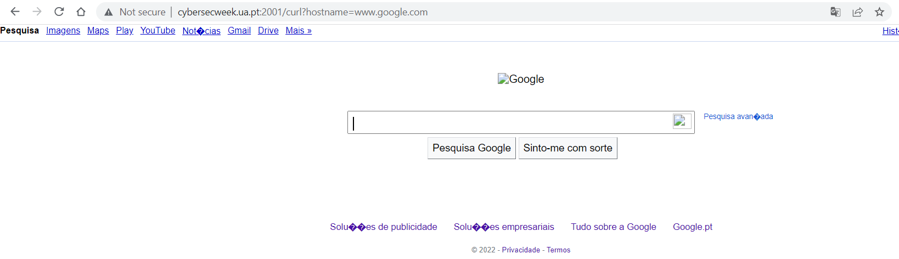
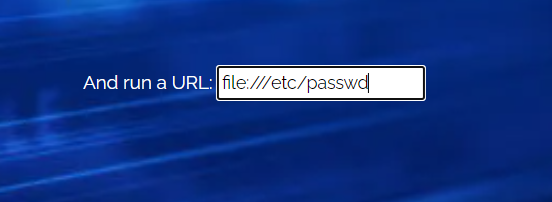
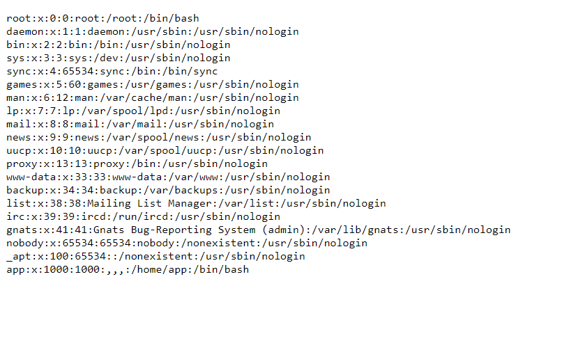

# Go, Land and Run

Challenge Description:

> Testing out if a website is acessible is not always easy, but using a popular command can be a good way to start.

## Analyzing the website

We are able to enter a url and the website would render the url in our webpage

From the url,we see curl written and we can assume that the hostname which we enter directly goes into the commandline tool curl.

Curl can also read local system files using the file:// protocol.So,we can use it to get the /etc/passwd file as shown.

Now,we can directly get the flag using `file:///flag`

