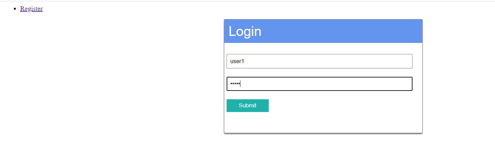
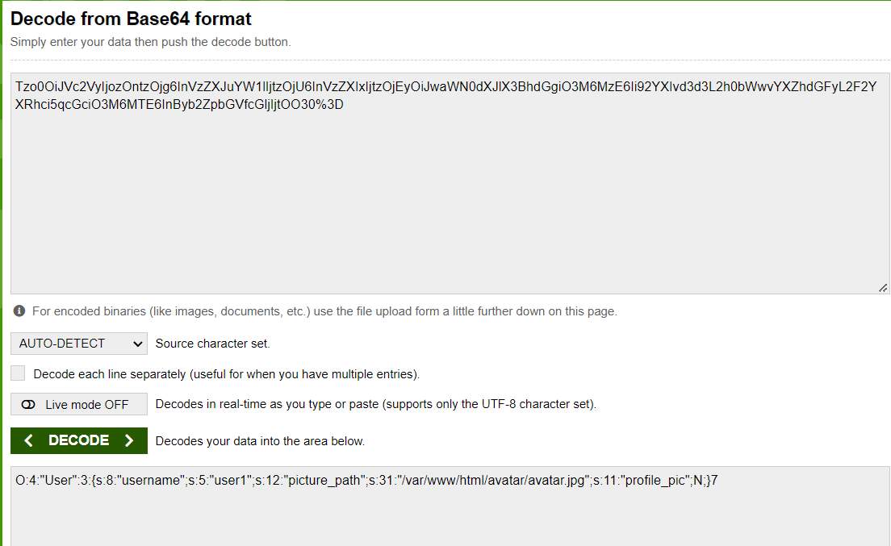
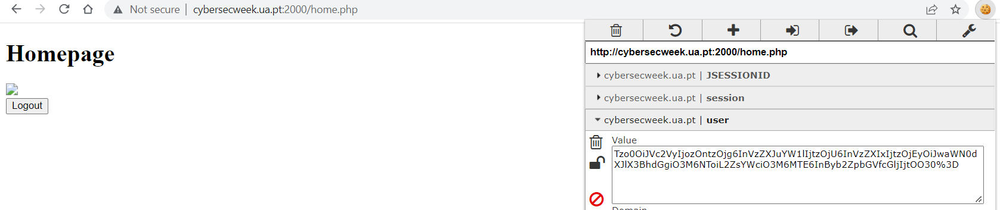

# Penguim - (De)Serial Killer

Challenge Description:

> Mr Penguim published a website where you can create an account and acess your profile, but be careful because the path to his profile picture is always staring at you.

## Analyzing the website

We are able to register a account and login with it as well.

A cookie named user is also set when we login.It seems like it url encoded because of the %3D at the end of the string and it is also base64 encoded.

`User : Tzo0OiJVc2VyIjozOntzOjg6InVzZXJuYW1lIjtzOjU6InVzZXIxIjtzOjEyOiJwaWN0dXJlX3BhdGgiO3M6MzE6Ii92YXIvd3d3L2h0bWwvYXZhdGFyL2F2YXRhci5qcGciO3M6MTE6InByb2ZpbGVfcGljIjtOO30%3D`

We decode it and we see that it is a php serialized object.

The picture_path attribute seems intresting because the home page of the user had a picture which might be getting loaded from this path.

Hence,we can try changing this to the flag's path and try loading it.

Modified cookie: `O:4:"User":3:{s:8:"username";s:5:"user1";s:12:"picture_path";s:5:"/flag";s:11:"profile_pic";N;}`

We encode this using base64 and convert the last '=' to %3D and replace the original cookie.

We see the source and there is some base64 encoded content being loaded from that path we gave.We decode it and get the flag.

flag --> `CTFUA{pHp_uns3r1aliZe_k1ng}`