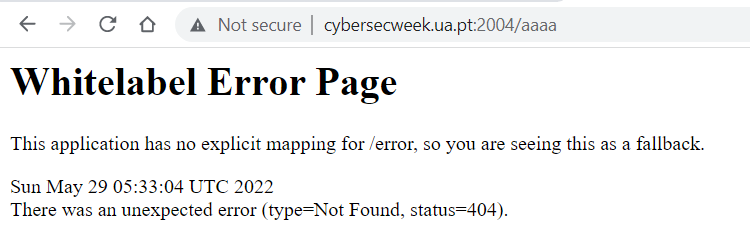

# Spring's Hell

Challenge Description:

> Some random org (seems more like a cult imo) made a website agains Spring season, oh the irony.

## Analyzing the website

We see a webpage with almost no functionality except subscribing to the newsletter using email.This did not lead anywhere although.

One interesting thing is that it is given that the website was built using spring.We can prove this by going to a path which does not exist and we get the below error.This is the default spring boot error page when a page does not exist.

So,i assumed that the page has some kind of spring vulnerability which we have to abuse.Googling a bit leads us to `spring4shell`.

This recent 0-day vuln exploits the mapping between user requests and java objects/classes.The `class` member of the object the parameter is bound to is exposed.

We can access different attributes of the class member and like directory,prefix,suffix,pattern to write a payload or JSP file to get RCE.The links below give a better understanding of it as well.
[Anotomy of spring4shell](https://www.dynatrace.com/news/blog/anatomy-of-spring4shell-vulnerability/)
[Exploitation of sprin4shell](https://www.trendmicro.com/en_us/research/22/d/cve-2022-22965-analyzing-the-exploitation-of-spring4shell-vulner.html)

We try to find a poc for the vuln and check if our challenge is vulnerable to it as well.
[SpringShell POC](https://github.com/BobTheShoplifter/Spring4Shell-POC)

During the ctf,the above poc worked fine and a .jsp file is uploaded which helps us to execute remote commands.
Url --> `http://cybersecweek.ua.pt:2004/tomcatwar.jsp?pwd=j&cmd=cat%20../../flag.txt`

But during the time of making this writeup,the same poc does not work anymore.I tried a few other and they didnt fare well as well.Im not sure whats the problem exactly and i will update this writeup when i find the reason or solution.