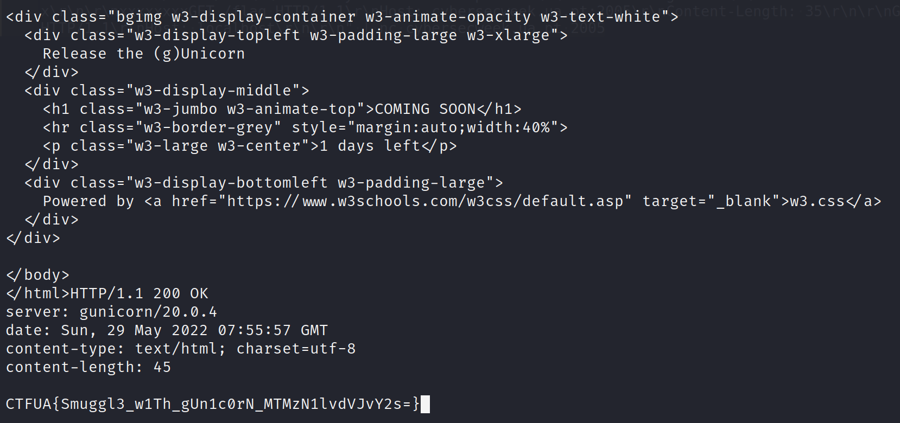

# Release the (g)Unicorn

Challenge Description:

> I was surfing the Internet and came across a unicorn and a cat guarding a door. Can you help me open it?

## Analyzing the website

Accessing the website gives us a picture of a unicorn and a cat and nothing more.The description says something related to gunicorn.

Gunicorn is said to be a python Web Server Gateway Interface HTTP server used for hosting python web applications.The requirements.txt file say that we are using gunicorn `20.0.4`.

From the source code which they give,we see a /flag endpoint which gives us the flag.


When we visit it,we say that it is forbidden.


This is because we have a haproxy.cfg which denies any requests which come to a path which has 'flag' in it.


Googling about haproxy says that it is a load balancer/reverse proxy.So our architecture looks somewhat like this probably.

```
User request --> Haproxy(Frontend) --> Gunicorn(Backend)
```

## Gunicorn and request smuggling

Okay,now searching for vulns related to gunicorn's version,we stumble upon a `request smuggling` vuln in gunicorn's 20.0.4 version.

Request smuggling can occur when the front-end server(Can be reverse proxy/load balancer) and the back-end server behave differently upon different request attributes like headers etc.Portswigger's article gives a pretty detailed explanation on some of its types as well.
(Portswigger Request Smuggling article)[https://portswigger.net/web-security/request-smuggling]  

The below link gives a POC on how gunicorn is vulnerable because of the `Sec-Websocket-Key1` header which assumes that the content-length of the request will be 8 bytes only.
(Gunicorn 20.0.4 Request Smuggling)[https://grenfeldt.dev/2021/04/01/gunicorn-20.0.4-request-smuggling/ts]

--> We can send `2 requests(1 normal + 1 in body of 1st request)` when sending to the haproxy reverse proxy.This will consider the whole request to be 1 part because the content-length will include the length of the 2nd request as well.

-->Now when haproxy sends this `1 request` to gunicorn,gunicorn will think of it as 2 requests because of the `Sec-Websocket-Key1` header which takes only the first 8 bytes of content and assumes the next content is the next packet.

-->The 2nd packet now can be a request to `/flag` and this would not give a forbidden error because we have already passed haproxy and come to the backend server.

We take the payload used in the link and change the content-length header.The content-length we finally get is 81.
`Note: Be careful when calculating the \r and \n bytes during newlines`


`Note: We can also create the payload using the printf command instead of echo`

We run the command and we get the flag as shown below.

`Note: The request sometimes gives out a invalid method error.Run it a few times to get the flag`