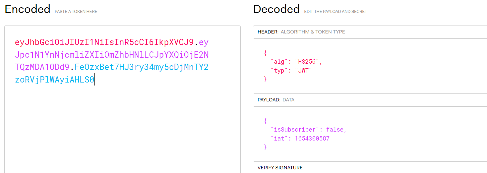
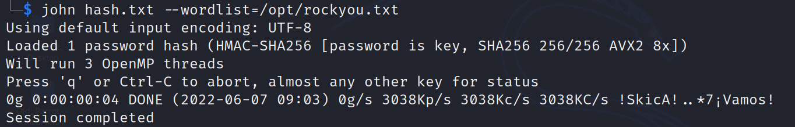
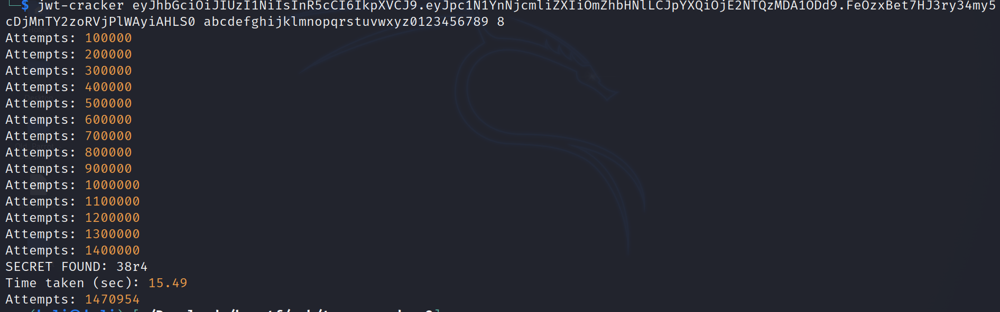
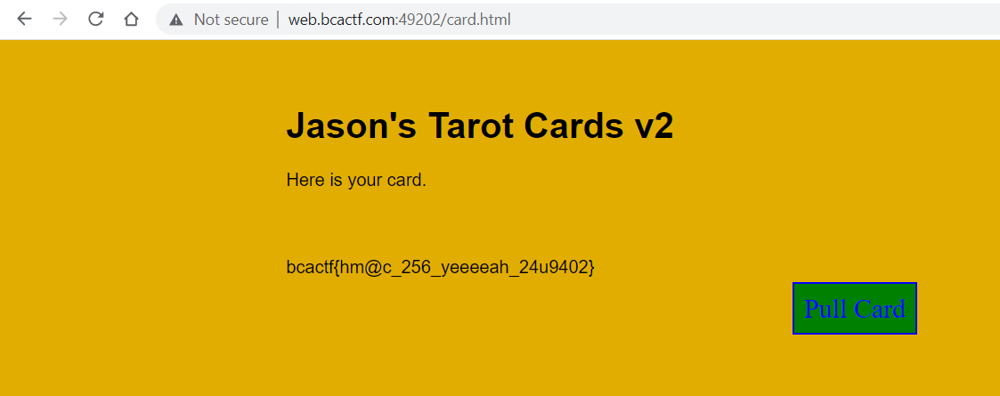

# Jason's Web Tarot 2

Challenge Description:

> I think Jason realized his last attempt at making a tarot website wasn't super secure... so he tightened his security a bit. I still really want that flag though...

> Hint1: What did he change?

## Analyzing the website

This time the jwt token is encrypted using `HS256(symmetric signing method)`.  

We can try to bruteforce the signing key from a wordlist incase it is a weak one.John the ripper can be used for this.This failed and did not find any words.   

  

We might have to bruteforce the key literally and we can do this using `jwt-cracker`.This can be installed through github.   

We find the key as `38r4` and we replace the key in jwt.io with this and change the subscriber to true.     

