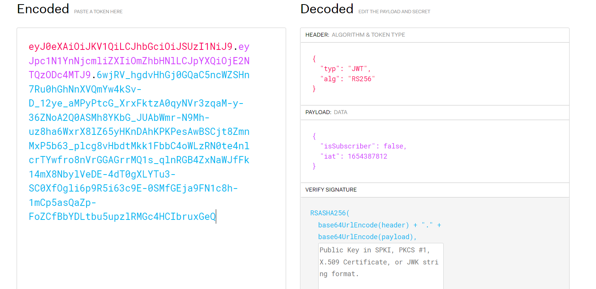
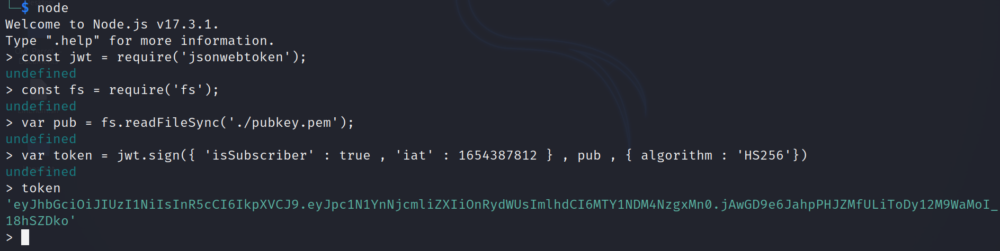

# Jason's Web Tarot 3

Challenge Description:

> Jason has just about had enough. You've outsmarted him 3 times and he is sure that you won't get past him this time. So try it if you can!

> Hint1: Jason finds this kind of web security very confusing

## Analyzing the website

This time the jwt token is encrypted using `RS256(asymmetric signing method)`.The challenge also provides a public key and a hint most likely referring to `type confusion`.



Type confusion lets us change the alogorithm from RS256 to HS256 and lets us sign a new token using the public key so that the server will decode the new token using the same public key and this becomes a `symmetric signing method`.

```js
app.get('/checktoken', (req, res) => {
	var retVal = defaultResponse;
	if (req.cookies.token) {
		var token =req.cookies.token;
		try {
			if (jwt.verify((token), PUBLIC_KEY)) {
				let decoded = decode(token)
				if (decoded.isSubscriber == true) {
					retVal = specialResponse;
				}
			}
		}
		catch {
			retVal = malformedResponse;
		}
	}
	res.setHeader('Content-Type', 'application/json');
	res.cookie("token", defaultToken);
	res.send(retVal);
});
```

The `jwt.verify()` command does not specify the decryption algorithm and because of this the forged token will be verified using HS256 and the public key.  

This is a problem in the `3.2.2 version of jsonwebtoken` which the server is using as specified in the `package.json` file.  
https://snyk.io/test/npm/jsonwebtoken/3.2.2 

We can forge the new token using nodejs's jsonwebtoken module as shown below.     



We replace the website's cookie with the forged token and get the flag.       

