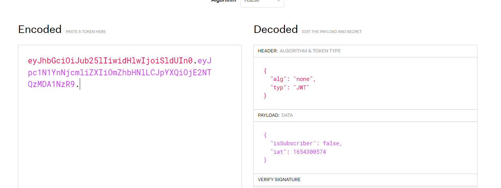
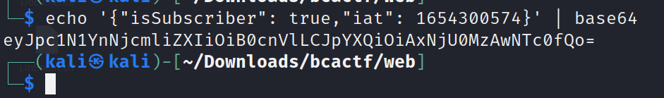
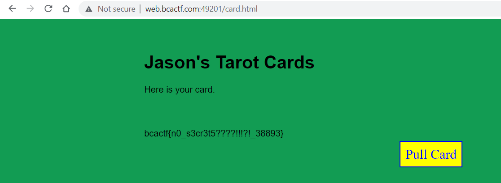

# Jason's Web Tarot

Challenge Description:

> I just found this amazing tarot card website! Legend has it that if you can subscribe to Jason's tarot service, he'll give you a free flag! Sadly, he closed down the subscription section of the site. Can you get me my flag?

> Hint1: How might the website keep track of if a user is subscribed?

## Analyzing the website

When we pull a card,a jwt cookie is set and we can analyze this using jwt.io.The algorithm set is `none` so we can change the `isSubbscriber` field from false to true.

We take the payload seperately and change false to true and base64 encode it again.  

  

Now we just modify the cookie present in the webpage with the one we just forged and we get the flag. 

