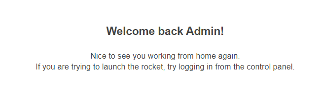
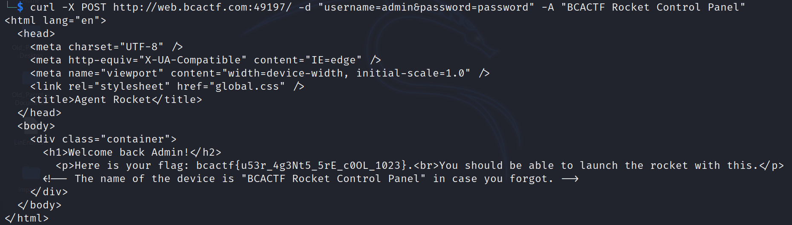

# Agent-Rocket

Challenge Description:

> I need to launch the BCA CTF ROCKET to the moon! Unfortunately I lost my launch code (flag). You can find the launch code in the control panel.

> Hint1: Have you tried looking at the website more CLOSELY?

> Hint2: You can't access the control panel from every device out there.

## Analyzing the website

We get to a login page whose credentials(username --> `admin` and password --> `password`) can be found by seeing the source of that page.We login and get to a admin page.  

The source of the admin page tells us `The name of the device is "BCACTF Rocket Control Panel" in case you forgot.`

The device mentioned above and hint2 might be referring to the user agent header which specifies the browser/device from which the request was originated.  

We can change the user agent and send the request to the admin page again using curl.  

Command --> `curl -X POST http://web.bcactf.com:49197/ -d "username=admin&password=password" -A "BCACTF Rocket Control Panel"`

We get the flag from the output of curl.  

