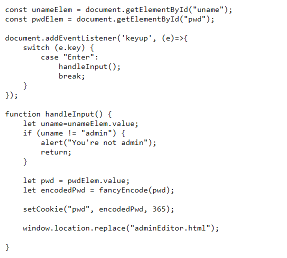
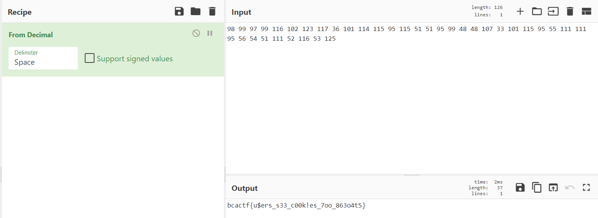

# Cookies

Challenge Description:

> Look, I made a website to teach you how to make cookies. There's some other recipes there too, and I made a super secure portal to add more.

> Hint1: Look through all the javascript files carefully

> Hint2: Cookies can be modified client-side

## Analyzing the website

There is a admin page which needs a username(default is Guest which is set by the website) and password.Viewing the `adminLog.js` file shows us that on succesfull authentication as admin,a encoded cookie is set based on our password and our window changes to `adminEditor.html`.

The encoding converts each of our characters in our password and appends the letter 'e' to it.  
Eg : 'b' --> '98e'  
	 'A' --> '65e'

On going to adminEditor.html directly,we see the source and see the `editor.js` file which checks if the encoded cookie = `98e99e97e99e116e102e123e117e36e101e114e115e95e115e51e51e95e99e48e48e107e33e101e115e95e55e111e111e95e56e54e51e111e52e116e53e125e`.

We can decode this by just removing the e's and convert the decimal to ascii.

