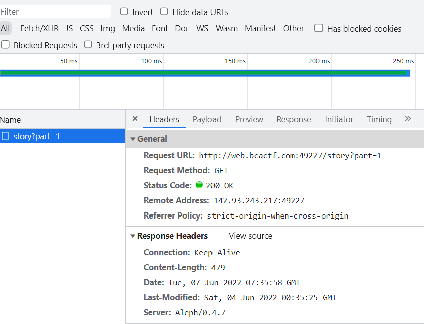
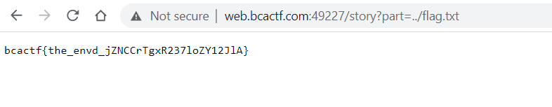

# BCACTF 3.0: Story Mode

Challenge Description:

> bestselling novel

> Hint1: How does this advanced paging technology work, anyway?

## Analyzing the website

According to .clj files given to us, the website uses the clojure programming language.  
[clojure.org](https://clojure.org/)

The website allows us to read a story by clicking continue which sends requests to `/story?part=num` to get content from the page.



Some of the core.clj functions are shown below which include the `check-flag` function to check the flag contents and the `get-story-part` function which gets executed when the webpage loads a part of the story(num --> 1 to 6).

`Slurp` --> Read the contents of a file

```
(defn check-flag [req]
  (if (= (request/body-string req) (slurp "flag.txt"))
    {:status 200 :body "yes"}
    {:status 400 :body "no"}))

(defn get-story-part [req]
  (let [part ((req :query-params) "part")]
    (if (nil? part)
      {:status 400 :body "No part specified"}
      (response/file-response (str "story/" part)))))
```

We can see that from the `get-story-part` function,that the `part` param is the get parameter which the user can pass and it is used to read file contents in `(response/file-response (str "story/" part))`.

Since,the flag is in the previous directory(specified in chall.yaml) , we can move back one directory and perform LFI and read the flag.  

URL --> `http://web.bcactf.com:49227/story?part=../flag.txt`    

