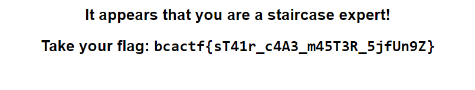

# three step trivia

Challenge Description:

> Us at BCACTF love staircases so much that we decided to make a trivia quiz about them! Are you a staircase expert? Can you solve all three steps?

> Hint1: The internet is a helpful resource

## Analyzing the website

There are meant to be 3 questions which can be directly googled and answered.The only problem is the submission in each question.  

Question1 --> Answer = `7.75` but the form only takes numbers so u can change the html from number to text or send 7.75 through curl which redirects you to `http://web.bcactf.com:49207/7_75`.

Question2 --> Answer = `11674` but there is no submit button so we just put the answer in the path like the previous question(`http://web.bcactf.com:49207/11674`).  

Question2 --> Answer = `163` but the button is hidden itself so remove the hidden attribute from the html and submit and get the flag.

