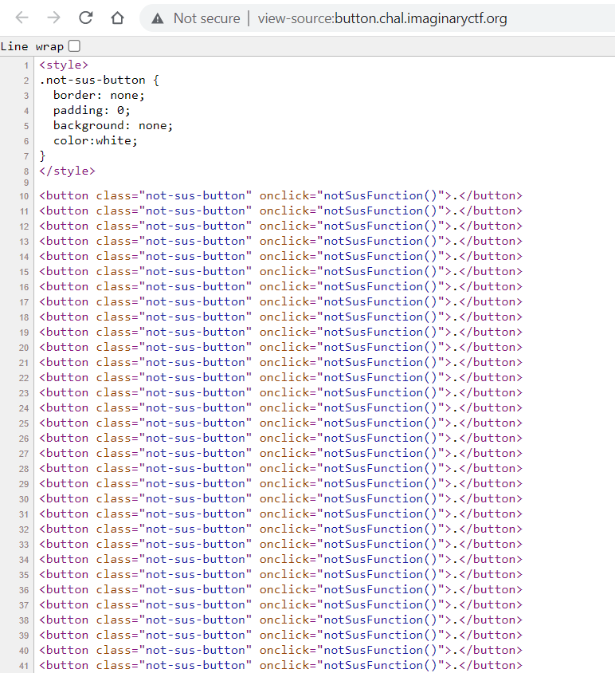
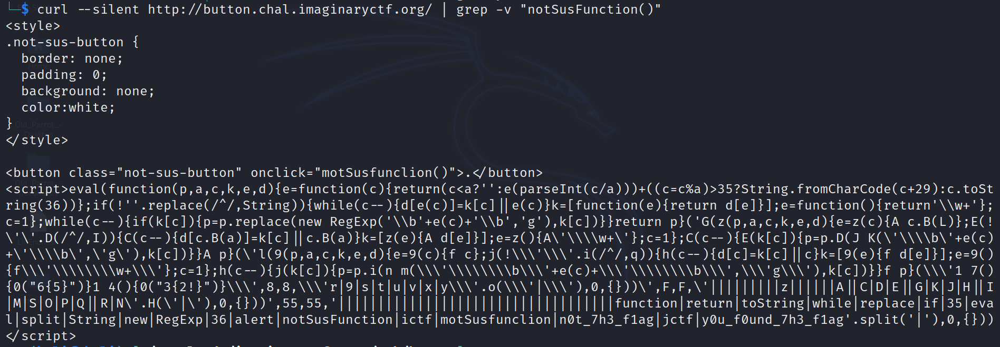
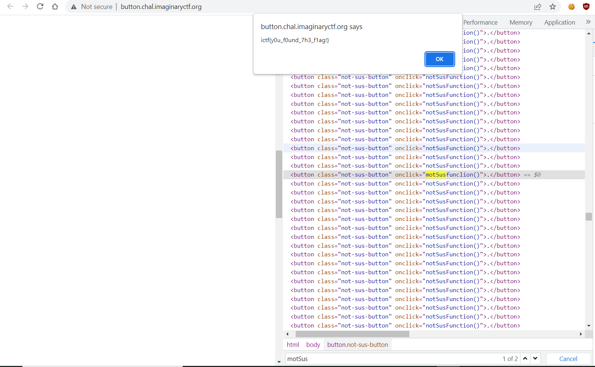

# Button

Challenge Description:

> Apparently one of these buttons isn't useless...

### <u>Analyzing The Website</u>

Viewing the source code of the challenge gives us various buttons which calls the ***notSusFunction***().  

The goal should should be to find a button which is different from the normal ones shown above.  

We can use curl and grep to see if there is any different output than what is observed.  

We see that there is a button which calls the **motSusfunction()** which probably prints the flag.  

We can just click on this button in the webpage which should give us the flag.  

Finding that specific button on the inspect tool and clicking it gives us a alert with the corresponding flag.  

