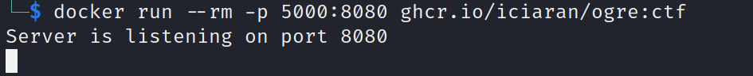
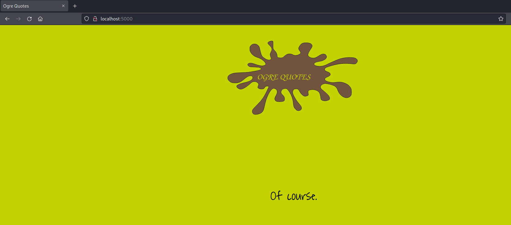
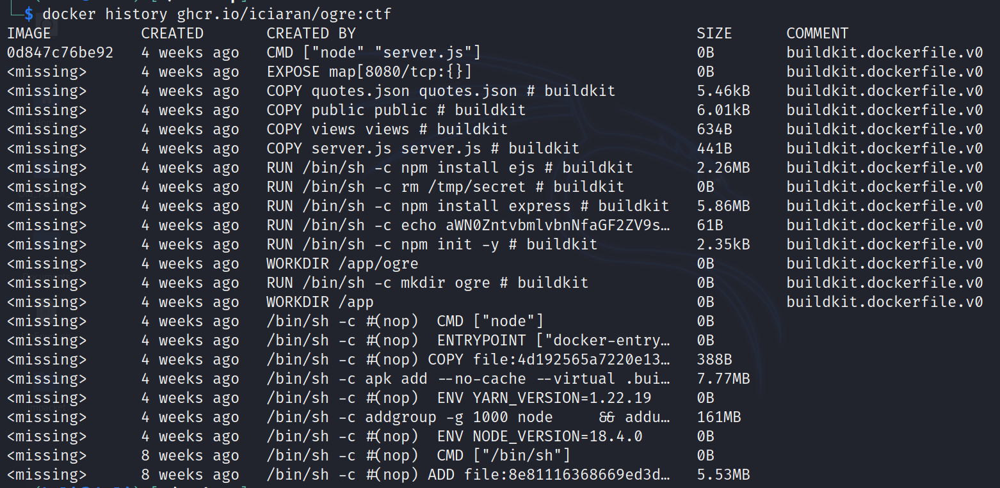
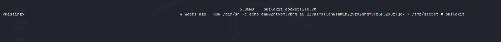

# Ogre

Challenge Description:

> What are you doing in my swamp?!

## Analyzing and running the image

We are given a image which we can pull and run in our local system. When run,it runs a service on port 8080 which we can use by docker's port forwarding mechanism.     

We access the website on port 5000 on our localhost and find a web service but not much more information regarding this.  

Analysis of the filesystem inside the container also did not reveal much information. So,we decided to check upon how the image was made itself. The `docker history` command gives brief information on how each layer of the image was built.  

We can see some base64 encoded text in one of the layers but it is not completely shown in the output above.  

We can use the `--no-trunc` flag to show the complete text as output.  

We can base64 decode this string to get the flag as needed.