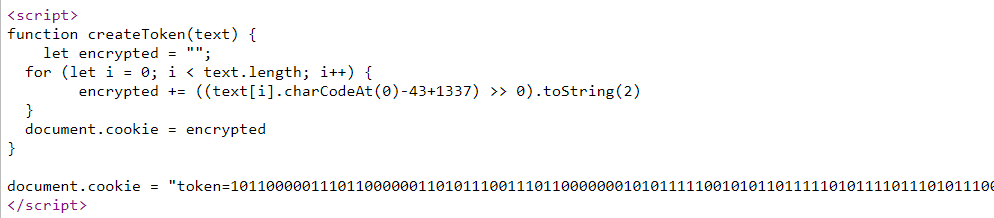

# RooCookie

Challenge Description:

> Roo seems to have left his computer on, can you find his password?


## Analyzing The Website

Viewing the source code of the challenge gives us a encryption script which takes some text(mostly the flag) and encrypts the text and stores the output in the cookie of the browser.    




We have the encrypted text in the cookie which looks like binary in this case.  
We can create a js script which just reverses our encryption process and give us the decrypted text as output.  
The script is given below  

```js
let cookie = "101100000111011000000110101110011101100000001010111110010101101111101011110111010111001110101001011101001100001011000000010101111101101011111011010011000010100101110101001101001010010111010101111110101011011111011000000110110000001101100001011010111110110110000000101011100101010100101110100110000101011101111010111000110110000010101011101001011000100110101110110101001111101010111111010101000001101011011011010100010110101110110101011011111010100010110101101101101100001011010110111110101000011101011111001010100010110101101101101100000101010011111010100111110101011011011010111000010101000010101011100101011000101110100110000"

for (let i = 0; i < 627; i = i + 11) {
        let binary = cookie.slice(i,i+11)
        let decimal = parseInt(binary,2)
        let char = String.fromCharCode(decimal-1337+43)
        process.stdout.write(char)
}
```

Running the above script gives the below output  
`username="roo" & password="ictf{h0p3_7ha7_wa5n7_t00_b4d}"`  


