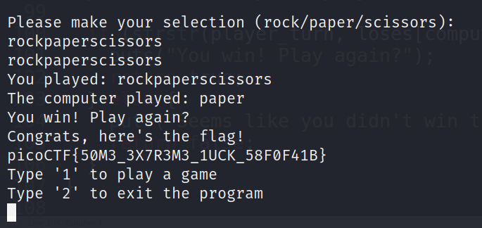

# RPS

Challenge Description:

> Here's a program that plays rock, paper, scissors against you. I hear something good happens if you win 5 times in a row.

> Hint1 : How does the program check if you won?

## Analyzing code and running the server

Running the server by connecting through netcat,we can see that we can give rock/paper/scissor as input and try to beat the server 5 times consecutively.
The source code uses rand() to determine which of the 3 choices will the server use every turn and this gives us a low oppurtinity to win 5 games in a row.
```c
int computer_turn = rand() % 3;
  printf("You played: %s\n", player_turn);
  printf("The computer played: %s\n", hands[computer_turn]);

  if (strstr(player_turn, loses[computer_turn])) {
    puts("You win! Play again?");
    return true;
  } else {
    puts("Seems like you didn't win this time. Play again?");
    return false;
  }
```

From the code above we can also see that the server using `strstr` with our input to check if it matches or not.

We can misuse strstr and provide a input which always contains rock/paper/scissor so that it will always be a win for us.
Example String : `rockpaperscissor`



The 5th try shown above gives us the flag as shown above.
