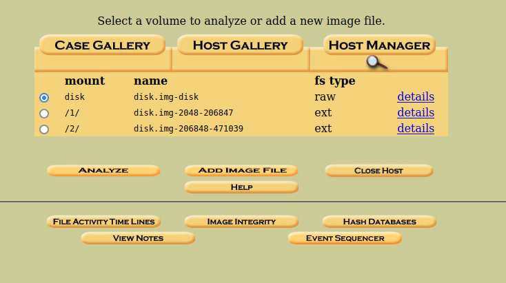
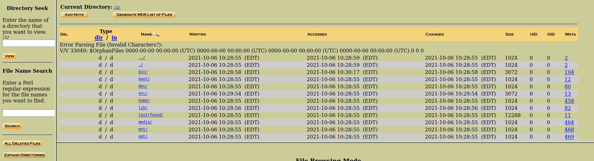
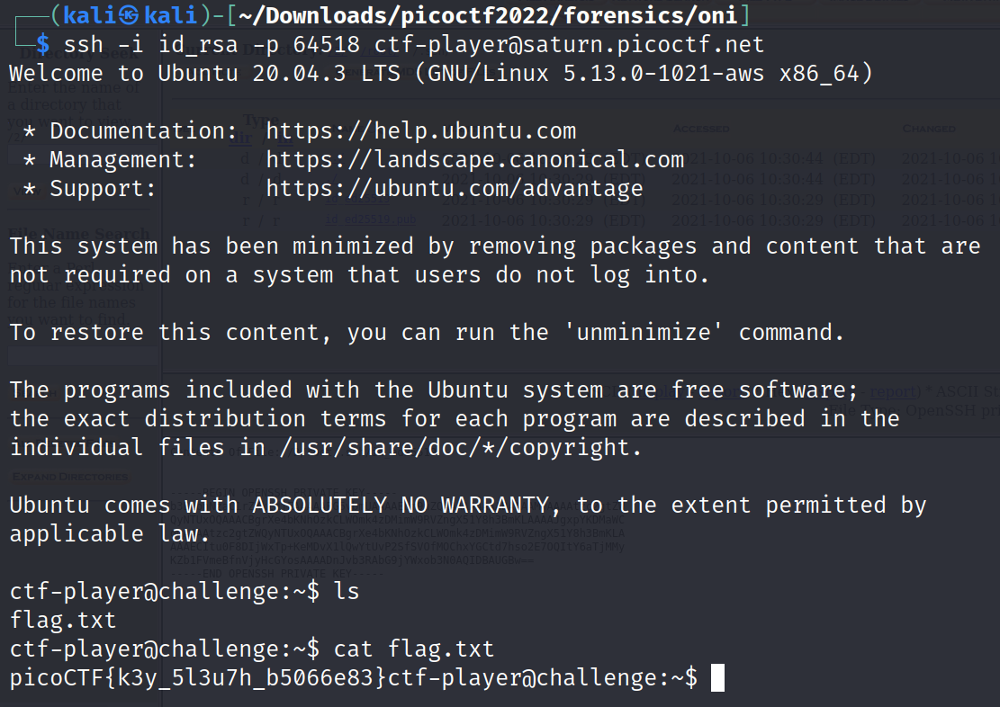

# Operation-oni

Challenge Description:

> Download this disk image, find the key and log into the remote machine.

## Analyzing disk image

We are expected to find the private key to login through ssh to a remote machine.Running the file command on the disk image gives the below contents.

`disk.img: DOS/MBR boot sector; partition 1 : ID=0x83, active, start-CHS (0x0,32,33), end-CHS (0xc,223,19), startsector 2048, 204800 sectors; partition 2 : ID=0x83, start-CHS (0xc,223,20), end-CHS (0x1d,81,52), startsector 206848, 264192 sectors`

There are 2 partitions and we they both are ext file systems which can be verified by using tools like fdisk,autopsy etc.

This time instead of trying to manually mount these partitions using the mount command,i tried using the autopsy tool to analyze it.We import the disk image and autopsy separates the partitions and shows it to us.

We try analyzing the first partition and we dont find much but the 2nd partition has a file system in it.

We go to the root dir and the .ssh folder to find the private key and export it to our local file system.

Now we can change permissions of the key and login to the remote machine and find the flag.

