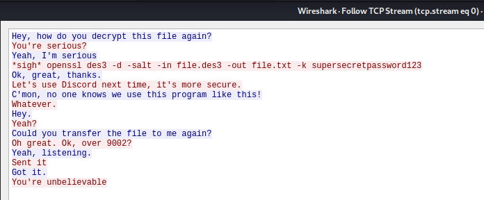
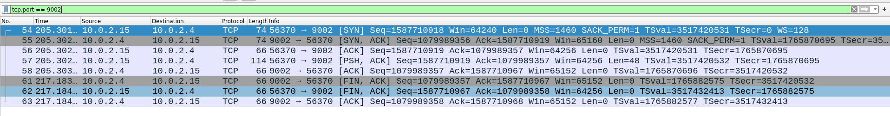
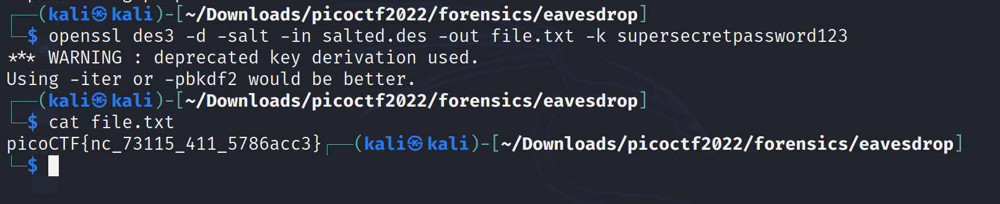

# Eavesdrop

Challenge Description:

> Download this packet capture and find the flag.

> Hint1 : All we know is that this packet capture includes a chat conversation and a file transfer.

## Analyzing pcap file

We are given a pcap file and we open it up in wireshark.

We see there is a tcp connection between 10.0.2.4 and 10.0.2.15 and we follow the tcp stream for that conversation.

We see that there is a file transfer on port 9002 and a decryption happening on a salted hash probably.

To try getting the file being transferred,we can try using wireshark's filter to only show requests which have a source or destination port as 9002.

Filter used --> `tcp.port == 9002`

Now,when we follow stream on this conversation we get a salted hash and some unreadable characters in it because not everything is printable.

We can save that packet's contents as raw and save it to file in the file system.I saved that hash to `salted.des`.

Now we can just decrypt the hash using the command used in the conversation earlier using openssl.

