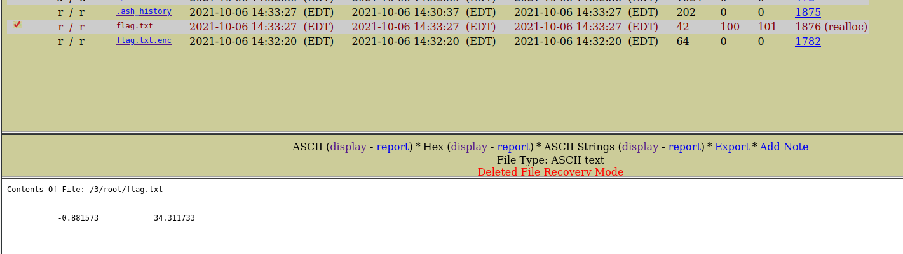
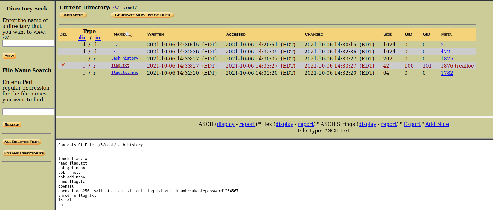
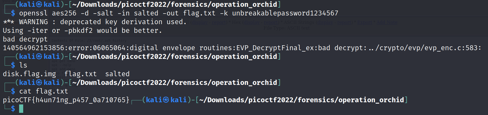

# Operation-orchid

Challenge Description:

> Download this disk image and find the flag.

## Analyzing disk image

Running the file command on the disk image gives the below contents.

`disk.flag.img: DOS/MBR boot sector; partition 1 : ID=0x83, active, start-CHS (0x0,32,33), end-CHS (0xc,223,19), startsector 2048, 204800 sectors; partition 2 : ID=0x82, start-CHS (0xc,223,20), end-CHS (0x19,159,6), startsector 206848, 204800 sectors; partition 3 : ID=0x83, start-CHS (0x19,159,7), end-CHS (0x32,253,11), startsector 411648, 407552 sectors`

We again use autopsy to analyze the partitions present.The 3rd partition is the one which actually had some contents.

We go to the root dir and we see `flag.txt.enc` and a deleted file `flag.txt`.Even though autopsy recovered the flag.txt file to some degree,the contents inside were still not deciperable.

The flag.txt.enc flag is a salted hash which is most likely encoded using openssl like the `eavesdrop` chall because it had a similar format.

We search some more and look into .ash_history and we see the history of commands used when encrypting the flag.

Now,we can just export the encoded data and decrypt it using openssl decode with the password given.

