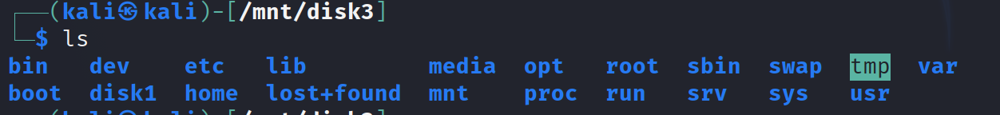
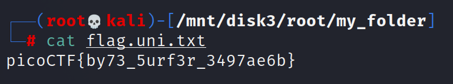

# Sleuthkit-apparentice

Challenge Description:

> Download this disk image and find the flag..

## Analyzing disk image

We are given a disk image and running the file command on it gives the below output.

`disk.flag.img: DOS/MBR boot sector; partition 1 : ID=0x83, active, start-CHS (0x0,32,33), end-CHS (0xc,223,19), startsector 2048, 204800 sectors; partition 2 : ID=0x82, start-CHS (0xc,223,20), end-CHS (0x16,111,25), startsector 206848, 153600 sectors; partition 3 : ID=0x83, start-CHS (0x16,111,26), end-CHS (0x26,62,24), startsector 360448, 253952 sectors`

We can see that there are multiple partitions in this disk image and that means we can most likely mount these 3 seperately as well.The below links are useful on learning how to mount a img file with multiple partitions.
[Mounting disk image with partitions](https://www.linuxquestions.org/questions/linux-general-1/how-to-mount-img-file-882386/)
[Mounting a disk image](https://unix.stackexchange.com/questions/82314/how-to-find-the-type-of-an-img-file-and-mount-it)

We run the fdisk command to view the partitions and start sectors of each of them so that we can mount it.
Command used --> `fdisk -l disk.flag.img`

```
Disk disk.flag.img: 300 MiB, 314572800 bytes, 614400 sectors
Units: sectors of 1 * 512 = 512 bytes
Sector size (logical/physical): 512 bytes / 512 bytes
I/O size (minimum/optimal): 512 bytes / 512 bytes
Disklabel type: dos
Disk identifier: 0x7389e82d

Device         Boot  Start    End Sectors  Size Id Type
disk.flag.img1 *      2048 206847  204800  100M 83 Linux
disk.flag.img2      206848 360447  153600   75M 82 Linux swap / Solaris
disk.flag.img3      360448 614399  253952  124M 83 Linux
```

disk.flag.img1 and disk.flag.img3 were the 2 main suspects here because the 2nd partition was expected to be a swap partition.

We make a directory called disk1 in /mnt directory and try to mount the img1 to that directory.
Command used --> `sudo mount -o loop,offset=1048576 disk.flag.img /mnt/disk1`

The offset = 512(Sector size) * 2048(Start sector for img1) = 1048576

When we go to the /mnt/disk1 directory,it turned out to empty for some reason so i instead tried mounting the 3rd img.
Command used --> `sudo mount -o loop,offset=184549376 disk.flag.img /mnt/disk3`

The offset = 512(Sector size) * 360448(Start sector for img3) = 184549376

This time when we go the /mnt/disk3,we see a linux file system.



We go to the root directory and find the flag,

