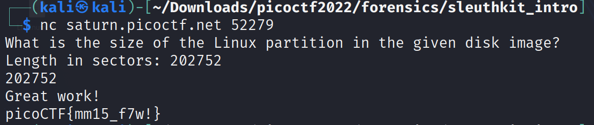

# Sleuthkit-intro

Challenge Description:

> Download the disk image and use mmls on it to find the size of the Linux partition.

> Connect to the remote checker service to check your answer and get the flag.

## Analyzing disk image

We are given a disk image and running the file command on it gives the below output.

`disk.img: DOS/MBR boot sector; partition 1 : ID=0x83, active, start-CHS (0x0,32,33), end-CHS (0xc,190,50), startsector 2048, 202752 sectors`

The description of the challenge tells us to use the mmls command to find the size of the 1 partition present in the disk image.

`mmls (1)             - Display the partition layout of a volume system (partition tables)`

Running the command `mmls disk.img` gives us the below output.

```
DOS Partition Table
Offset Sector: 0
Units are in 512-byte sectors

      Slot      Start        End          Length       Description
000:  Meta      0000000000   0000000000   0000000001   Primary Table (#0)
001:  -------   0000000000   0000002047   0000002048   Unallocated
002:  000:000   0000002048   0000204799   0000202752   Linux (0x83)
```

We can see that the linux partition is 202752 sectors as shown above.The first 2 entries is expected to contain the partition table and the bootloader because this is a complete disk and not only a partition of a disk.

Connecting to the remote server with the number of sectors,we get the flag.

